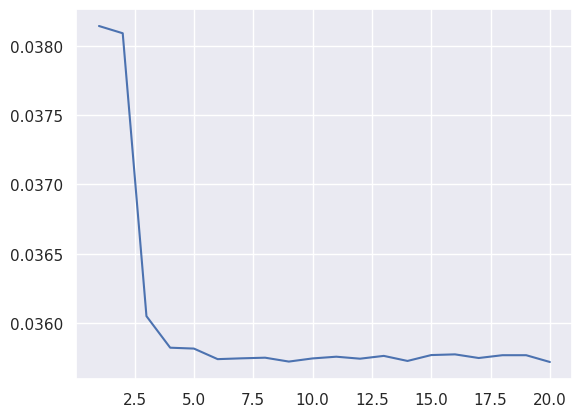
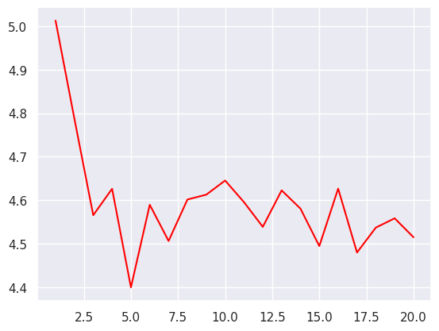

# Transformer Encoder for Language Modeling
 Transformers have gained prominence as a result of addressing the limitations of previous approaches 
to language modeling, namely Word2Vec and RNNs. Word2Vec suffers from assigning a fixed vector to 
each word without considering its contextual dependencies. On the other hand, RNNs were
slow and unidirectional, focusing solely on the words preceding a particular word.
In contrast, transformers are bi-directional and, despite their O(N^2) complexity, modern hardware
allows for fast parallel computations. Crucially, transformers vectorize words based on
their surrounding context, meaning that the same word can have different representations in different sentences.

## Usage

First initialize train and validation dataloaders:
```python
dataloader_builder = DataloaderBulder()
vocab_size = dataloader_builder.vocab_size
train_dataloader, val_dataloader = dataloader_builder.get_loaders()
```

Then initialize the model:
```python
model = Predictor(max_seq_length, vocab_size, embed_dim, 6)
model.to(device)
```

Initialize criterion, optimizer, scheduler:
```python
criterion = nn.NLLLoss()
optimizer = torch.optim.SGD(model.parameters(), lr=lr)
scheduler = torch.optim.lr_scheduler.StepLR(optimizer, 1.0, gamma=0.1)
```

Train the model for one epoch
```python
train_epoch_acc, train_epoch_loss = train(model, optimizer, criterion, train_dataloader)
```

Evaluate the model on validation set:
```python
accu_val, loss_val = evaluate(model, optimizer, criterion, val_dataloader)
``` 

## Visualizing Loss (left: train, right: validation)
Here is the loss after 30 minutes of training.
<br/>
 